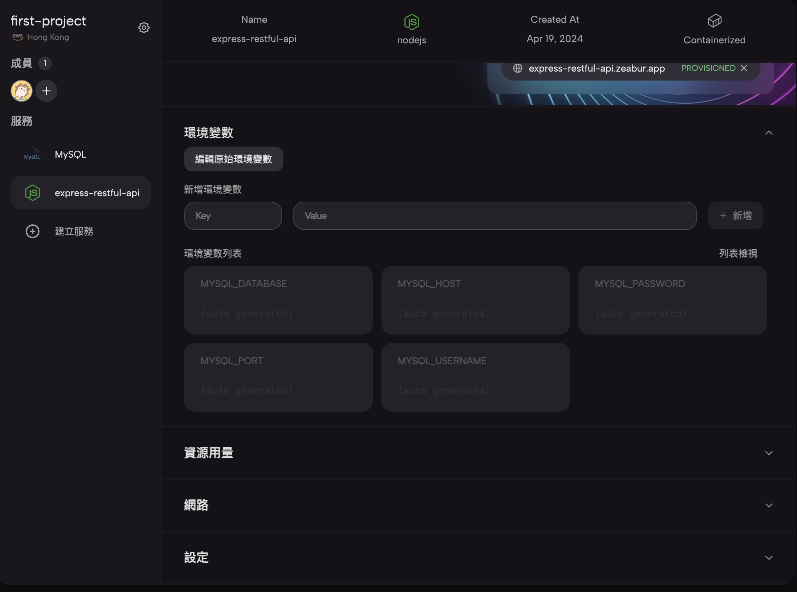

# Express Restful API

這是一個很陽春的 Restful API，主要內容是參考以前用 json-server 寫的 [簡易 API](https://github.com/jubeatt/practice-restful-api/tree/main) 來改寫的。

因為主要是寫來測試用，所以內容會稍微有一點點不一樣，可以參考這張表格：

| 說明         | Method | path       | 範例             | 回傳值                          |
| ------------ | ------ | ---------- | ---------------- | ------------------------------- |
| 獲取所有書籍 | GET    | /books     | 無               | [ { id: 1, name: "海洋帝國" } ] |
| 獲取單一書籍 | GET    | /books/:id | 無               | { id: 1, name: "海洋帝國" }     |
| 新增書籍     | POST   | /books     | { name: "書名" } | 無                              |
| 刪除書籍     | DELETE | /books/:id | 無               | 無                              |

目前這個服務部署在 [Zeabur](https://zeabur.com/) 上，你可以透過 [https://express-restful-api.zeabur.app/books](https://express-restful-api.zeabur.app/books) 來玩玩看。

因為是第一次使用 Zeabur，所以這邊會分享一些個人使用上的心得。

## 為什麼會想用 Zeabur？

Zeabur 這個平台其實在剛推出時我就有聽過了，因為那時候我人剛好在 Zeabur 創辦人開的前端 Line 社群裡面，所以有在群內看到 Zeabur 的宣傳訊息。

其實當時沒有特別關注這個平台提供了哪些服務，因為我自己大部分都是用 Github Page 來放一些簡單的靜態網頁，用到現在其實也都用的蠻習慣的，沒有碰到什麼太大的問題。真的要說有什麼缺點的話，應該就是它真的只能放「純靜態的網頁」而已吧，如果想要跑 Server 或者有連資料庫需求的話都沒有辦法做到，必須要改用其他方式才行。

過去想部署非靜態網頁的時候我有用過兩種方式，一種是在 [AWS](https://aws.amazon.com/tw/ec2/) 上跑一台虛擬主機，另一種是透過 [Heroku](https://www.heroku.com/)。不過現在兩個服務我都沒有用了。Heroku 的話是因為改成收費制，AWS 的話則是前置作業有點麻煩（如果你好奇怎樣麻煩的話，可以參考我之前寫的[部署紀錄](https://jubeatt.github.io/2022/03/08/deploy-my-website/)），所以當時停掉以後我就沒有考慮要再重架一次。

一直到了前幾天看到 Huli 寫了一篇[文章](https://blog.huli.tw/2024/04/14/zeabur-introduction-deploy-service/?fbclid=IwAR3QlMLstodq6ymDEmk14AiwHp1yfrq21r78KxEqYvuKFm4EEwGyG9VnjyY)來介紹 Zeabur，讀完以後覺得好像還真的蠻方便的？（看來代言有成功 XD），所以就想說那我也來試試看好了，也就有了這次使用 Zeabur 的初體驗。

## 實際使用 Zeabur 部署的流程

這次部署的專案是用 Express 寫的 API，並且會用到資料庫，所以等於要跑兩個服務，一個用來跑 Express，一個用來跑資料庫（順道一提這邊用的是 MySQL）。

Express 的部分就跟 Huli 的文章內講的一樣，只要把程式碼放到 Github 上以後再去 Zeabur 的後台導入進去它就會自動幫你跑 build 然後就部署完了，跑起來之後會像這樣子：


至於 MySQL 的部分 Zeabur 有提供的 Pre-Built 好的鏡像檔來直接部署：


這邊有小驚艷了一下，因為真的是一鍵按下去以後就等沒多久就部署好了，完全不用做額外的處理，直接就有一個現成的資料庫可以用了。

還有一個蠻貼心的地方是在 MySQL 跑起來以後 Zeabur 會自動幫你在其他服務裡面注入相關的環境變數。如果打開剛剛的 Express 就會發現裡面已經多了 MySQL 的相關變數：



接著再拿這些變數去修改一下原始碼，整個部署作業就完成了，真的是蠻簡單又快速的。

## 使用心得

總體來說，這次用 Zeabur 部署的使用體驗都有比以前用 AWS 或是 Heroku 來得更好，在 Zeabur 上真的是一鍵按下以後服務就跑起來了，幾乎不用花什麼心力。

如果要問我會不會想推薦其他人來用 Zeabur？我想應該是會的。

第一是 Zeabur 支援的程式語言跟框架蠻廣的，第二是比較熱門的服務都有提供 Pre-Built 鏡像檔（MySQL、PostgreSQL、MongoDB 這些都有），如果是想要放作品或小玩具但又不太想花太多心力在部署上的人來說，真的可以考慮看看 Zeabur。

那我自己會想用嗎？我覺得應該也是會考慮的，但應該會以動態網頁為主，其他靜態網頁我還是會繼續放在 Github Page 上。

我自己未來是有考慮想放一些小玩具或工具在網路上，拿 Zeabur 的付費機制來算的話我推估一個月大約會落在 150-250 之間的價格（台幣），以這樣的價格換來換取方便的部署服務我自己是覺得蠻 ok 的，所以或許會考慮升級成付費版吧。

## 開發筆記

這邊附上跟這份專案相關的一些資訊，有興趣的人再往下看就好了。

1\. Node.js 版本為 v14.21.2

2\. 請自行建立 .env 檔案並填入以下內容：

```PORT=3001
HOST=xxxx
DATABASE=xxx
USERNAME=xxx
PASSWORD=xxx
DB_PORT=xxx
```
